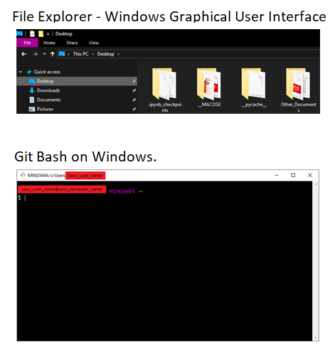

# Unix Shell Commands

The **Unix Shell** is a **command-line interface (CLI)** and a **scripting language**.  

It allows you to **automatize** processes and **access** the files and directories of your computer in an effective way. Much more effective than using the computer system’s graphical user interface (see Figure below).  

The most popular Unix Shell is **Bash**: the **Bourne Again SHell**. But there are many more! In this repository we will only focus on **Bash**.

## First things first: let's install Bash

* [Installing Bash Shell on Windows](https://github.com/HeatherAn/installations-instructions/blob/main/Install-Bash-on-Windows.md)
* [Installing Bash Shell on Linux](https://github.com/HeatherAn/installations-instructions/blob/main/Install-Bash-on-Linux.md)
* [Installing Bash Shell on MacOS](https://github.com/HeatherAn/installations-instructions/blob/main/Install-Bash-on-MacOS.md)

________________________

[Previous : README](https://github.com/HeatherAn/recommended-coding-practices#readme)  
[Next     : 02 - Typing Bash Commands](https://github.com/HeatherAn/recommended-coding-practices/blob/main/02-Typing-Bash-Commands.md)  

[Go back to README](https://github.com/HeatherAn/recommended-coding-practices#readme)