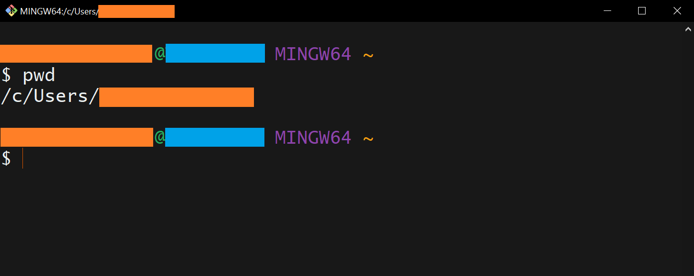

# Typing Bash Commands

Now that you have installed Bash, let's **open** the terminal!

On macOS and Linux, look for the **terminal** within the installed applications (e.g., on macOS click the **Launchpad** icon in the **Dock** and type `terminal` in the search field). For macOS later than 13, the default shell is **zsh**. Thus, to use **bash** just open a terminal and type `bash`.

On Windows, open the **Start Menu** and type `Git Bash`.  

The famous black screen is now open! You will see a **prompt**, which indicates that the Shell is waiting for input. The Shell typically uses the `$` character as the **prompt**, but it may use a different symbol. In the following, just type the commands, and after each command (or line of commands) press the **Enter** key to execute the instruction(s). 

____________________________

### Important 

All instructions given in this repository will be based on **Git Bash** (installed on Windows). But in general the instructions can be followed also for Linux and macOS operating systems (just consider paths and some commands may vary slightly).
____________________________

## Location, location, location...

When the terminal opens, it opens *at a specific location* within the device. To see *where* you are (in which directory you are), use the **print working directory** `pwd` command. When typing `pwd` and pressing the **Enter** key, the *current* directory (the directory you are in) will be printed in the terminal.



In the figure above, *orange rectangles* cover the space where your **username** shows up. *Light blue rectangles* cover the space where the **device name** shows up. In this case, typing the `pwd` command prints the **home directory** of the *current* user: `/c/Users/your_user_name`.  

___________________________________________________________
### Important to keep in mind: `root` and `home` directories

- **Root directory**: This is the directory that **holds everything in your computer**. You can also refer to this directory by using the slash character `/`. Inside the **root directory** there are several directories. Depending on your operating system you will find: `bin` (where some built-in programs are stored), `Users` or `usr` (where users’ personal directories –incl. yours– are located), `tmp` (where temporary files are stored), etc. Try it out and -wherever you are- type `cd /` in the terminal. This will automatically *take* you to the **root directory**. If you now type `ls`, all contents of the **root directory** will be printed in the terminal.  

- **Home directory**. This is where your **personal directories** are located (where all your files -as a **user** of the device- are). On Windows the path of your home directory will look like this: `/c/Users/your_user_name`. In other operating systems, the home directory path will look different (for example, on Linux it may look like `/home/your_user_name`).  

    Do you want to see what your **home directory** has? Wherever you are type in the terminal `cd` alone (do not forget to press **Enter** to execute the command). This automatically *takes* you to the **home directory**. If you now type `ls`, all contents of the **root directory** will be printed in the terminal.  
___________________________________________________________

 
## To move around: `cd` Command

Remember that we are using the terminal to **navigate through directories and files** within the device, instead of going through the directories with **Windows Explorer** or the **Finder** in macOS systems for example. So **instead of clicking things, we will be typing instructions**  through the command line!

Try typing the following commands (do not forget to always press the **Enter** key to execute each instruction).

`cd` : Wherever you are, this command (written alone) takes you to your **home directory**.  

`cd path_dir` :  (replace `path_dir` by the path of any directory within the device) this instruction will take you from your *current directory* (the directory where you are) to the `path_dir` directory. When specifying the path to a directory keep in mind whether you are providing a **relative path** or an **absolute path**.  

- The **relative path** of a directory/file specifies a **location starting from the *current* location**. For example: consider *you are* in your **home directory** (`/c/Users/your_user_name`) which contains a `Downloads` directory. If you want to *go* to `Downloads` then you can do: `cd Downloads`. If you now do `pwd`, you will see you are in `/c/Users/your_user_name/Downloads`.   
- The **absolute path** of a directory/file specifies a **location from the *root directory* of the file system** (from `/`). For example: consider your **home directory** (`/c/Users/your_user_name`) which contains a `Documents` directory and a `Downloads` directory. Inside `Documents` there is a `data` folder. Let's say *you are* in `/c/Users/your_user_name/Documents/data` and you want to move to the `Downloads` directory. Then one way of going there would be using the **absolute path** to `Downloads` by typing: `cd /c/Users/your_user_name/Downloads` (see we are starting from `/`).  

___________________________________________________________

#### Important to keep in mind: the `~` (tilde) 

The Shell interprets the character `~` (tilde) at the start of a path to mean “the current user’s **home directory**”. This is what the tilde (in orange font color) refers to in the figure shown above. Thus typing `cd ~` is analogue to typing `cd`. 

So when is the `~` necessary then? When you want to indicate the **absolute path** to a file or directory. For example: instead of typing `cd /c/Users/your_user_name/Downloads`, you could type `cd ~/Downloads`.

___________________________________________________________


`cd ..` : when typing `..` bash understands “the directory containing this one”, or in other words, the **parent directory** of the **current directory**.  

- **Special comment**: when typing `.` (only one dot) bash understands “the current directory”. Thus, typing `cd .` will not "move" you from your current directory. 

`cd -` : when typing `-` bash understands "the previous directory you were in".   
    For example: let's say *you are* in `/c/Users/your_user_name/dir1`. Then you go directly to another directory called `/dir2` by doing `cd /c/Users/your_user_name/dir2` (that is, by using the **absolute path** to `dir2`). Then doing `cd ..` will take you to `/c/Users/your_user_name`, while doing `cd -` will take you to `/c/Users/your_user_name/dir1`.

__________________________________________________________________

#### Parenthesis

- Also consider that when looking at paths of files/directories and using the Windows graphical user interface (**File Explorer**), directory names in a path appear to be separated with `\`. While on the Shell they appear separated by a `/` character. Thus **avoid copy-pasting the paths** from the **File Explorer** to Git-Bash. Get used to managing directories and files via the terminal alone.

- In the terminal you can press the **up arrow** key to see the former commands you have used.

- When writing files and directories in the terminal, you can start typing their names and use the **tab** key for auto-completion. For example: you want to go to `Documents` in your **home directory**. Then you would start typing `cd ~/Do`. Pressing the **tab** key at this point will print to the terminal all files and directories inside `~` which start with "Do". If `Documents` is the only object you have that starts with "Do", then pressing the **tab** key will automatically write `Documents`. 

- When working with the terminal, you might want to clear the screen once in a while. For this you can use the `clear` command. This command (alone) clears the screen of the terminal, leaving the prompt at the top of the terminal. It does not erase anything, and it does not *take* you anywhere else.
___________________________________________________________

## To list content of directories : `ls` Command 
 
`ls` : this command (alone) lists the (non-hidden) contents of the *current* directory.

`ls -a` : lists all contents (including hidden) contents of the *current* directory. Hidden files usually start with a dot (`.`).  

`ls -l` : (with a lower case “L”) lists all the (non-hidden) contents of the *current* directory, plus their size, last modified date and time, owner of file and respective permissions.

`ls -lS` : (with a lower case “L” and an upper case "S") lists the same as `ls -l` but with all files and directories sorted by size.

`ls -lh` : (with a lower case “L” and a lower case "H") lists the same as `ls -l` but with the size in human readable format (KB, MB, etc.).

`ls -R` :  lists all the (non-hidden) contents of the *current* directory, and the content of the sub-directories within that current directory.

See more on `ls` command by typing `ls --help`. If you are on macOS, use `man ls` instead (`man` as in "manual").

___________________________________________________________

#### Important to keep in mind: flags

As you can see with `ls`, there are extra options that you can specify when using the command. This is not only for the `ls` command. Most commands take so-called **flags** (options) which begin with a (dash) `-`. These flags can usually be combined. For example: `ls -lh` is the same as `ls –l –h`.  
___________________________________________________________
 
## To create directories : `mkdir` Command 

`mkdir name_dir` : make (create) directory called `name_dir`. Replace `name_dir` by the name of the directory to be created within the **current directory**, or it can be the **absolute path** with the name of the new directory. 
    For example: let's say *you are* in `/c/Users/your_user_name/dir1`. Then you can create a sub-directory called `sub_dir1` within `dir1` by doing `mkdir sub_dir1`.  
    Another example: let's say *you are* in `/c/Users/your_user_name/dir1`. Then you can create a directory `dir2` in the **parent directory** of `dir1` by doing `mkdir ../dir2`. Do `pwd` to see you have not actually *moved*! Do then `cd ..` and `ls` to see that the `dir2` has been created.  

`mkdir –p name_dir/sub_name_dir/subsub_name_dir` : the `-p` flag allows `mkdir` to create a directory with any number of **nested sub-directories** in a **single operation** (a single line of commands). Then from the **current directory**, you can create a structure of directories inside it! 

___________________________________________________________

### Recommendation:

Do not use white spaces for names of files and directories. Use `_` instead. This will facilitate a lot the writing of paths.
___________________________________________________________

## To create an empty file: `touch` Command 

`touch my_file` : creates an empty file in the *current* directory (replace `my_file` with the name of the file -it can include its path- you want to create).  
    For example: you want to create a `README.txt` or `script.py` file, then you type `touch README.txt` or `touch script.py` respectively.

### Do you want to edit the file? 

You can start editing a file (any text type of file) by using:  

- text editors that will open *within* the terminal itself, such as **vi** or **nano**;

- text editors that will open *outside* the terminal (as a separate application) such as **VSCode** and **Emacs**. For example: to open a python script called `script.py` on [**VSCode**](https://code.visualstudio.com/), you can type in the terminal `code script.py` (you have to have VSCode already installed in your system). In fact you can open several applications and files via the terminal. You only have to make sure all executables are added to the (loved and hated) **PATH**! (see [Environment Variables](https://github.com/HeatherAn/recommended-coding-practices/blob/main/03-Environment-Variables.md) section).  

- Another way to add text to a file is to use the `echo` command. This option is particularly useful when you want to add something short and in a fast way to a file. 

### The `echo` Command

The `echo` commands prints whatever you write next to it to the terminal. 

`echo string` : prints the string `string` to the terminal.  

`echo string > my_file.txt`: instead of printing the string `string` to the terminal, it prints it to the file called `my_file.txt`.  
    For example: 
    - when doing `echo "First line of file" > my_file.txt`, the file `my_file.txt` will now contain "First line of file" in it. 
    - When using `>>` instead of `>`, the string will be positioned after the last line of the file. 

### Do you want to see the contents of the file to the screen of the terminal?

`cat my_file.txt` : prints the contents of the `my_file.txt` file to the screen of the terminal (replace `my_file.txt` with the name of the file you want to see). Then you can immediately see its contents in the screen of the terminal, instead of opening the file with a separate application that may take longer to open. Particularly useful for quick check ups of files.

___________________________________________________________

## To move (or rename) files : `mv` Command 

`mv file1 dir1` : when the first argument is a *file* and the second argument is a *directory*, `mv` moves the *file* to that *directory*. You can provide the name of the file (if the file is in the *current* directory) or the path of the file (if the file is in another directory).
    For example: let's say *you are* in `/c/Users/your_user_name/dir1` and you want to move a PDF file called `file1.pdf` (that is in the *current* directory) to the `/c/Users/your_user_name/dir2` directory. Then you can type: `mv file1.pdf /c/Users/your_user_name/dir2`, or more effectively: `mv file1.pdf ../dir2`  
    Another example: let's say *you are* in `/c/Users/your_user_name/` and you want to move `file1.pdf` (which is in `/c/Users/your_user_name/dir1`) to `/c/Users/your_user_name/dir2`. Then you can type: `mv dir1/file1.pdf dir2`  

`mv file1 file2` : when both arguments are *file names*, `mv` renames the first file to the second file name provided as input (here you should replace `file1` by the name of the file you want to rename, and `file2` by the new name you want to give it). Both `file1` and `file2` can also be given as paths. For example: `mv /c/Users/your_user_name/file1 /c/Users/your_user_name/file2`.

___________________________________________________________

### Be cautious about overwriting files!

Keep in mind `mv` will **silently overwrite any existing file**. A recommended option (especially when starting with Bash commands) is to use the **interactive** flag: `mv -i` (or `mv --interactive`). This will ask you for confirmation before overwriting.  

___________________________________________________________

## To copy files : `cp` Command 

`cp file1 file2` : copies the file given as a first argument to the file given as the second argument (here you should replace `file1` by the name of the file you want to make a copy of, and `file2` by name of the file you want to be the copy of `file1`). Both files can also be given as paths to the respective files. For example: `cp /c/Users/your_user_name/file1 /c/Users/your_user_name/file2`.

___________________________________________________________

### Parenthesis

For copying a directory and all its contents you can use the recursive flag `-r`, e.g. to back up a directory. For example: `cp –r thesis thesis_backup`.

___________________________________________________________

## To delete files/directories : `rm` Command 

`rm file1` : deletes a file (replace `file1` by the file you want to delete). **Be aware this command deletes the file FOR-E-VER. So be careful!**

`rm -i file1` : using the interactive flag -`i`, this command interactively asks if you *really* want to delete such file. Reply with `y` or `n` if you *want* or you *do not want* to delete it respectively.

`rm –r dir1` : deletes a directory (replace `dir1` by the directory you want to delete). As above: **be careful!**

`rm –ri dir1` : by adding the `i` flag the command will interactively ask you if you really want to delete such directory. Reply with `y` or `n` if you *want* or you *do not want* to delete it respectively.

___________________________________________________________

### Important to keep in mind: wildcards!

When copying/moving/deleting a lot of files/directories at once: use **wildcards!**

- The asterisks `*` is a wildcard that **matches zero or more characters**. 
    For example: let's say *you are* in `/c/Users/your_user_name/dir1` and you have a sub-directory in it called `sub_dir1`. You want to move all `.txt` files that are in `dir1` into `sub_dir1`. Then in `/c/Users/your_user_name/dir1` you can type: `mv *.txt sub_dir1`. This will move all `.txt` files at once.
- The `?` is a different wildcard that **matches exactly one character**. For example: let's say *you are* in a given directory, and inside that directory you have 3 files called `data.txt`, `data1.txt` and `data10.txt`. Then `data?.txt` would refer only to `data1.txt`. While `data*.txt` would refer to `data.txt`, `data1.txt` and `data10.txt`.

___________________________________________________________  

## To find strings/files/directories : `find` and `grep` Commands

The `find` command helps you find files or directories anywhere in your device. The `grep` command instead is used to find strings in files.  

`find dir1 -type f -name "file1"` : searches for a file called `file1` inside the directory `dir1` (and all its sub-directories) and lists them in the terminal. For case insensitive match use `-iname` instead of `-name`.

`find dir1 -type d` : searches for all directories (`-type d`) inside the directory `dir1` and lists them in the terminal.   

`grep "str1" file1` : searches for a string `str1` in the file called `file1`and prints the results in the terminal.   

`grep -r "str1" dir1` : searches for a string `str1` in all files of the directory `dir1`and prints the results in the terminal.  

___________________________________________________________  

## To look through the history : `history` Command - BONUS piping!

Sometimes it is useful to look through the history of commands within the *current* Shell session and/or previous Shell sessions.  

When you open the terminal, you initiate a Shell session. You can look at all the commands you have typed so far by typing `history`. Once you close the terminal, the in-memory history gets written to the hidden `~/.bash_history` file. 

For example, if you want to look for a given instruction you used at some point within the *current* Shell session (e.g., when you copied a directory into another directory with `cp -r`), you can *pipe* the `history` with the `grep` command:

```
history | grep 'cp -r'
```

The *pipe* '|' takes the output of the `history` command, and it gives it as input to the -in this case- the `grep` instruction, which will look at all the command lines that had 'cp -r' in it.  

### Parenthesis: piping vs re-directing

**Piping** ('|') takes the output of the instruction to the left of the '|' symbol, and it gives it as input to the instruction that is on the right of the '|' symbol. 

Not to be confused with **re-directing** which uses the '>' and '<' symbols for output re-direction and input re-direction, respectively. 
    The **output re-direction '>'** is what we have seen before (see `echo` command example), when the output of the instructions to the left of the '>' symbol is re-directed to a file (which is specified to the right of the '>' symbol).   
    The **input re-direction '<'** gives the contents of the file specified to the right of the '<' symbol, as input to the instruction specified to the left of the '<' symbol.  
___________________________________________________________  

Aside using commands to navigate and manage files and directories, you can also **create Bash scripts** (with `.sh` extension) and execute them by doing `bash name_script.sh`, where `name_script.sh` is the name of the script (include the path to it, if it is not in the *current* working directory). Doing this will allow you to automatize workflows (creation of files, backups, renaming of files, running python scripts at a given order, etc.) all by running a single script!

Interested to practice exercises about Bash? Visit the [Software Carpentry lesson!](http://swcarpentry.github.io/shell-novice/) 

Check the [Bash Cheatsheet](https://github.com/HeatherAn/recommended-coding-practices/blob/main/04-Bash-Cheatsheet.md) for a summary of the commands mentioned here and more!

________________________

[Previous : 01 - Unix Shell commands](https://github.com/HeatherAn/recommended-coding-practices/blob/main/01-Unix-Shell-Commands.md)  
[Next     : 03 - Environment variables](https://github.com/HeatherAn/recommended-coding-practices/blob/main/03-Environment-Variables.md)  

[Go back to README](https://github.com/HeatherAn/recommended-coding-practices#readme)