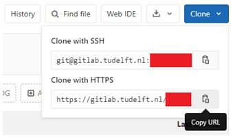

# Using Git For The First Time

First make sure you have been given **access** to the Gitlab group **ASCM Professor X - Y**, where **X** refers to the lastname of your supervisor and **Y** refers to your initials. And that you have access to a project in that group called **Project_Y** (where **Y** are your initials). This will be your *remote* (online) repository.

In the TU Delft Gitlab instance (https://gitlab.tudelft.nl) go to **Project_Y** > **Project overview** > **Details** > **Clone** button. Copy the **https_key**. This is the http address you will give to your *local* Git repository, in order to "link" the *local* with the *remote* repository.

In your device, open the **terminal** (for Windows users: remember to use **Git Bash**) and go to the directory where you want to **clone the online repository**. Do this by using the `cd` command.

Let's say you want to clone the repository in `/c/Users/your_user_name/Documents/`. Then in that directory type:

`git clone https-key dir1` : here **https-key** is the http address of the TU Delft Gitlab (*remote*) project you want to "copy" (see Figure below), and **dir1** is the directory where you want to "dump" the contents of the TU Delft Gitlab repo.
   For example: let's say *you are* in `/c/Users/your_user_name/Documents/`, and the TU Delft Gitlab repository you want to clone in there is called **Project_Y**. Then to clone the *remote* repository you must type: `git clone https-key .` (where `https-key` is the one you copied from the TU Delft Gitlab). Here we are using the single dot `.` to tell Git to clone the *remote* repository to the *current* directory (instead of the dot, you could also use the **absolute path** `/c/Users/your_user_name/Documents/`). Then the *online* repository will be cloned to `/c/Users/your_user_name/Documents/Project_Y/`.

FYI: in the figure, the red rectangles are covering information for visualization purposes only.

______________________
### Parenthesis

- When cloning a repository with `git clone`, Git defines as **origin** the repository with the **https_key** you provided. 

- If you want to use a different name for the *local* repository (different from the name of the *remote* repository), then you can do the following:

   * `mkdir dir1` : to create the directory (replace `dir1` by the path of the directory where you want to work in). This director will be the directory where you will *clone* the online repository.

   * `cd dir1` : to go to the directory where you want to **clone** the online repository.

   * `git init` : to initialize a Git repository in `dir1` (a hidden `.git/` directory will be created, which you can see by doing `ls -a`). This will be the so-called *local* **master** branch.

   * `git remote add origin https_key` : this is to tell Git which is the **origin** (*remote*) repository that should be "linked" to the *local* repository created within `dir1`. Replace `https_key` by the corresponding key of the TU Delft Gitlab online repository.

   * `git pull origin master` : this will "copy" the contents of the (*remote*) **origin** repository to the directory where the (*local*) **master** has been defined.

__________________________
### Parenthesis

- If you want to make sure you have the right **origin**, you can check the **current origin** by typing `git remote –v`. If the **origin** is not the right one, then you can change it with `git remote add origin https_key` as above.

- Keep in mind **origin** is the alias with which your device refers to the *remote* Gitlab repository. In principle you can change this alias, but you are advised not to (especially when learning how to use Git). During this Wiki we will stick to the **origin** and **master** aliases. 
__________________________

# Start working locally on the files

After **initializing** or **cloning** a repository, you can start working on the files of your *local* **master** branch (which is the only branch you have so far), *pulling*/*pushing* from/to the *remote* repository. 

When you work on files inside the directory where Git has been initialized, you have to tell Git *"hey, keep track of this file"* and *"hey, record the changes made to this file and add this metadata to those changes"*. The first thing is calling **adding** files to Git, and the second thing is making a **commit** of changes made to a file. 
 
Let’s say you started working on `file1` (e.g., a Python `.py` script) doing all changes in your device (in your *local* Git repository at `~/Documents/Project_Y`). Use:

`git add file1` : this will tell Git to basically "pay attention" to this file ("keep track of it") and put it in the so-called **staging area**. 

Let’s say you created a function on `file1`. Then you have to **commit** such change (so that there is a record that a function has been added to the file). To do this type:

`git commit -m “text_commit1”` : this will tell Git to **record such a change** with the **descriptive metadata** `“text_commit1”`. Replace `“text_commit1”` with a short description of the change made to the file. For example: `git commit –m “Added sum function”`. If you only type `git commit`, the editor you set by default (when installing Git) will open so that you can write the **descriptive metadata** `“text_commit1”`. But always try to keep `“text_commit1”` as short as possible. See the following [blog](https://chris.beams.io/posts/git-commit/) where you can find principles on how to write Git commit messages.

## Difference between adding and committing

*Adding* and *committing* might be a bit confusing at first. Think as if you were preparing the clothes you will take for a trip. You first put the clothes on your bed to have an overview of what you will be taking to the trip. In this case, the act of *putting the clothes on the bed* would be `git add`; while the *bed* itself would the so-called `staging area`. 

Once you have *finally decided what to take* on your trip, you *put the clothes on the suitcase*. In this case, *putting the clothes on the suitcase* would be like doing a `git commit`.

While working on a file, and between **adding** and **committing**, you might also find useful the following commands:

`git add --all` : to add all changes made to all files to the **staging area**. For example: 
   - you modify `file1` and `file2`, all within the same *(local)* repository. 
   - Then you do `git add --all` and then `git commit –m “Change X in file1 and change Y in file2”`
   - Then you do `git push origin master`. You will then see the changes in the TU Delft Gitlab *(remote)* repository linked to this *(local)* **master**.

`git status` : this will show you the *tracked* and *untracked* files. The “untracked” file(s) message means that there is(are) file(s) in the directory that Git is **not keeping track of**. If you want Git to track them, then you should **add** the files using `git add file_name`.

`git diff` : shows the changes you have done *locally* (compared to the last version that was **committed**) but you have **not added** (with `git add` to the *staging area*) **nor committed** (with `git commit`).

`git diff --staged` : shows the changes you have done *locally* (compared to the last version that was **committed**) and that you have **added** (with `git add` to the *staging area*) but you have **not committed** (with `git commit`).

## Rule of thumb: when to *add* and when to *commit*?

Every time you make **small changes** to a file, use `git add file1` (where `file1` is the name of the file you have been working in). 

Every time you **finalize an important task**, do a **commit**. Remember **commits** have **descriptive metadata** attached to them. Hence, try to commit significant changes and use **descriptive metadata** that will allow your future self (and that of your colleagues) to understand in a few words what change you did in that **commit**. 

## What about *pushing*?

Every time you **take a break** or **by the end of your working day**, **push all commits** to the respective *online* TU Delft Gitlab repository. This will "sync" the *online* (*remote*) repository with your *local* repository. For this, type the following in the **terminal** (in the directory where the *local* repository is):

`git push origin master` : to **push** the changes made *locally* to the *remote* TU Delft Gitlab repository. Once you have done this, you should be able to see the changes in the remote TU Delft Gitlab repository. Try it out!

________________________

[Previous : Setting up Git](Setting-up-Git)  
[Next : Using Git for the Nth Time](Using-Git-for-the-Nth-Time)

[Go back to Purpose](Purpose)