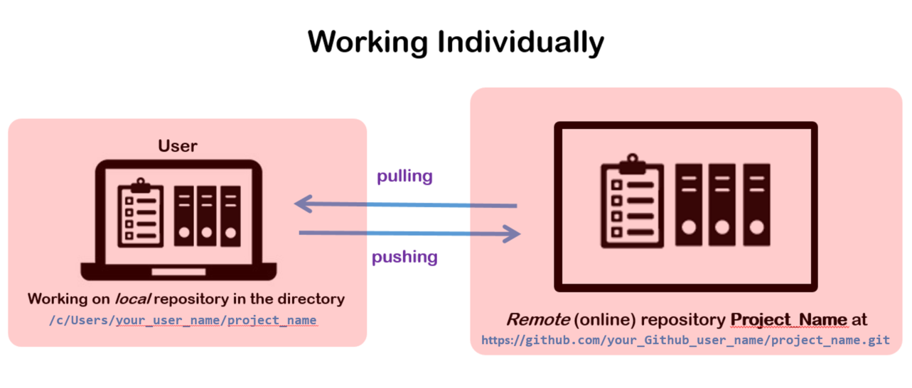
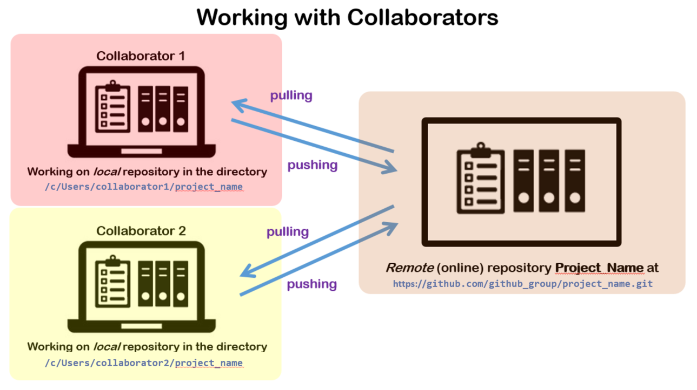

# Setting up Git

Now that you have installed **Git** on your device (laptop/workstation), you have to **configure** it accordingly. We will do this via the terminal (Windows users: remember we use the terminal of **Git Bash**). Keep in mind that in the following we will assume you will use **Github** for the remote repositories (but the instructions are quite similar for e.g. Gitlab).

Open the terminal. 

Starting at your **home directory** (make sure you are there by using the `pwd` command) type the following commands to set up your Git account:

`git config --global user.name “X”` : where **X** is your name in Github. For example: if your name is Jane Smith then on the prompt of **Git Bash** type  `git config --global user.name “Jane Smith”`

`git config --global user.email “Y”` : where **Y** is same email as used in Github, e.g. `J.Smith@myemail.com`.

`git config --global core.editor “Z“` : where **Z** is the text editor of your preference. For example:  
- For **Kate** (Linux):  `git config --global core.editor "kate"`
- For **Gedit** (Linux, Windows):  `git config --global core.editor "gedit --wait --new-window"` 
- For **Vim** (all): `git config --global core.editor "vim"`
- For **VSCode** (all): `git config --global core.editor "code --wait"`
- For **Emacs** (all):  `git config --global core.editor "emacs"`

Keep in mind, some editors open **within** the terminal itself (e.g., **Vim** or **nano**) while others will open **outside** the terminal as a separate application (e.g., **VSCode** or **gedit**). Recommendation: use editors that open **within** the terminal itself. Then you will get used to shorten your **commit** messages.

__________________________

### Parenthesis: Git configuration files

There are actually 3 Git configuration files: a **system** one, a **global** one and a **local** one. You can see what is defined in each one of them by using the `--system`, `--global` and `--local` options together with `--list`:

- `git config --system --list` will show the `--system` settings which apply to every user on the system/device and all their repositories.  
- `git config --global --list` will show the `--global` settings that are stated in the `~/.gitconfig` file (or `~/.config/git/config` file if applicable) and that specify settings for all the repositories you have as a user.  
- `git config --local --list` will show the `--local` settings that are stated in the `./.git/config` file (see **Initialize a *local* repository** below) and that specify settings for the specific repository you are in. If you have a Gitlab and a Github account for example, here is where you can specify which account will be used for the remote repository of that specific project.  

Type `git config --help` to see the help page for Git configuration options.
__________________________

# Start working with Git

When working with Git on your *local* files, you need to **initialize** a (*local*) repository (in your laptop/workstation) or **clone** a *remote* repository (so that you have a "copy" of the *remote* repository in your *local* device).


## Initialize a *local* repository

Go to the directory where you have the files you want Git to start tracking. Let's say you want to start working on **Project_Z** in `~/Documents/Project_Z`. If you have not created the directory `Project_Z` inside `~/Documents`, remember you can do that with the `mkdir` command:

```
cd  
cd ~/Documents  
mkdir Project_Z  
cd Project_Z
```

Now you can **initialize** a Git repository in `Project_Z` by typing: 

```
git init
```

`git init` initializes a Git repository in the directory where you have the files you want Git to start tracking. Git will create there a **hidden directory** called `.git` (you can see it by doing `ls -a`). The `.git/` directory is where the history of all (tracked) files (including the ones in sub-directories) will be stored. Git will now track all the changes made to the files in `Project_Z`.

**Be aware**:  
    - if you delete the `.git` directory (e.g., by doing `rm -rf .git`) you will delete all the history of changes but you will not delete the files.  
    - **Git does not track the creation or removal of directories**. Git **only tracks files**. It will automatically “know” *where* the files are. But it will not track the creation of empty directories.  

## The Master/Main Branch

When doing `git init` in `Project_Z`, Git *by default* creates what is called: the **master** branch. This is the *local* **master** branch. 

What is a branch? A **branch** can be thought of as a **separate copy** of a repository where you can make changes. Those changes will stay in that branch, unless you merge that branch with another branch. In that sense, each branch allows you to follow a **different line of development** of the project. We will cover more about **branches** in [Using Git with Branches](https://github.com/HeatherAn/recommended-coding-practices/blob/main/10-Using-Git-with-Branches.md) section. You can have several branches for the same project, and you can name each branch differently. For now, just remember that `git init` creates a *local* **master** branch by default.

## Change Master to Main in Github (for now)

Since late 2020 Github has decided not to name the default branch as **master**, but change it to **main**. This change was decided because of the cultural sensitivity towards the word **master** (see more about the change [**here**](https://www.theserverside.com/feature/Why-GitHub-renamed-its-master-branch-to-main)). Keep in mind that *for now* this only applies to Github. But Git keeps on calling the default *local* branch as **master**. Thus, when working with Github, after initializing a Git repo with `git init`, you will have to rename the default *local* branch as **main**. To do this, go to the terminal and type: 

```
git branch -M main
```  

From now onwards, we will refer to the default branch as **main**.  

__________________________

### Important to keep in mind: do not nest Git repos!

**Do not nest Git repositories**. In other words: do not do `git init` in a sub-directory of the directory where Git has already been initialized. **This will just create conflicts!** You only need to initialize a repository once. 

For example: let's say you have the directory `~/Documents/Project_Z` where you will start working on a given project. Doing `git init` in `~/Documents/Project_Z` will initialize a repository there, and will create a *local* **main** branch there. Let's say you are working in another project at the same time (not related to `Project_Z`) and you want to use Git to also track those files. Then in the directory of such project (let's say it is in `~/Documents/Project_W`) you do `git init` (only once!). This will initialize a different Git repository there. This repository will also have its own *local* **main** branch, where its own line of developments will be followed. 
__________________________

## The origin

As mentioned before, you will be working *locally* on your files in your *local* Git repository (in the *local* **main** branch). You will sync this *local* repository with the *remote* **Project_Y** in Github. This *remote* repository is *locally* recognized by Git as the famous **origin**. In that way, Git "knows" to which *remote* **origin** (Github repository) the *local* changes should be synced to.

The **origin** will also have its own **main** branch by default. Thus when looking at the *remote* branches of your project via the terminal, you will see it as the **remotes/origin/main** branch.

## Summarizing the initial situation

- You will have a *local* Git repository, created by typing `git init` in a working directory (in your device). This will create the *local* **master** branch by default. Since you will be working with Github, you need to rename this *local* **master** branch as **main** by using `git branch -M main`.  
- You will have a *remote* Git repository in Github (the **Project_Y** in Github). This *remote* repository also has a **main** branch (created by default when the repository is created in Github). This **main** branch is recognized by your *local* Git repository as the **remotes/origin/main**.  
- You will be making changes to your files *locally*. To "synchronize" the *remote* repository with all the changes you make *locally*, you will be *pushing* the changes to the *remote* repository. Likewise, if changes are made directly via the Github, you will be *pulling* those changes to your *local* repository, before start working *locally* on your files. 

This *pushing* and *pulling* workflow becomes extremely important when you work with more branches, either by yourself (you create branches to explore testing of the code for example) or in collaboration with others (each collaborator works on a separate branch for example). We will cover more of this in the [Using Git with Branches](https://github.com/HeatherAn/recommended-coding-practices/blob/main/10-Using-Git-With-Branches.md) section.





In the following section, we will start by providing the basics to do version control on files without dealing (yet) with collaborators and without creating (yet) more branches. 


________________________

[Previous : 06 - Version control with Git](https://github.com/HeatherAn/recommended-coding-practices/blob/main/06-Version-Control-With-Git.md)  
[Next     : 08 - Using Git For the First Time](https://github.com/HeatherAn/recommended-coding-practices/blob/main/08-Using-Git-For-The-First-Time.md)

[Go back to README](https://github.com/HeatherAn/recommended-coding-practices#readme)