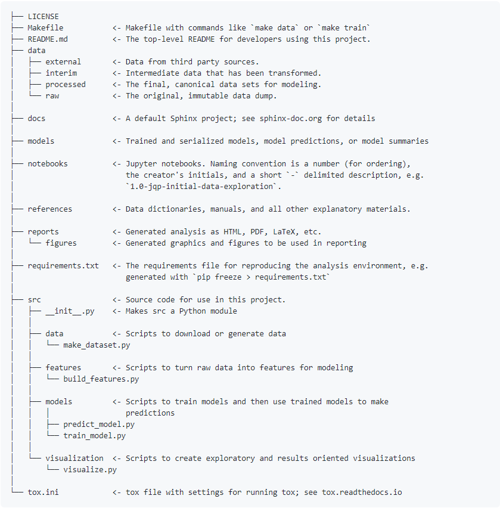

# Project Structure

So far we have used the word *"project"* to refer to a Git/Github *"repository"*. In this section we also use this definition. But of course, all the recommendations presented here are for generic projects (i.e. not only code projects version controlled with Git).

## General Structure

In order for your project to be easily understood by your **future self and others** (your supervisor, your collaborators), the project must have a **proper directory structure**.  

As a rule-of-thumb a proper directory structure should have as a minimum the following content:  

- **README** file  
- **LICENSE** file  
- **notebook**  
- **data** folder   
- **code** folder (often named `src`) 
- static copy of the **raw (original) data**  
____________________________________________________________

Image by [Peggy und Marco Lachmann-Anke](https://pixabay.com/users/peggy_marco-1553824/?utm_source=link-attribution&amp;utm_medium=referral&amp;utm_campaign=image&amp;utm_content=1015594) from [Pixabay](https://pixabay.com/?utm_source=link-attribution&amp;utm_medium=referral&amp;utm_campaign=image&amp;utm_content=1015594)

## README

In every project there should be at least a **top-level README** file in a simple text format (e.g., `.txt` or `.md`).  

Generally speaking, the README file is where you will be **documenting**: 

- what the code does  

- how the code/repository is structured  

- what is needed for the code to run (dependencies and versions of libraries with which the code has been developed)  

- instructions on how to compile and run the code  

- references and acknowledgements (this could also be in a separate directory within the repository)

The README in a repository should be **understandable** not only by you (and your future self!), but also by others (especially if the repository becomes public or it is open for others within the group to collaborate in). 

**Recommendation:** do not write the README at the very last minute. But **keep it alive** during the development of the project. And by the end of the project ask a colleague for **feedback** on it.

_________________________________
### Parenthesis

By now you have probably noticed that Github has the option to initialize the repository with a **README**. We have recommended not to tick that option for educational purposes only (to explain how to `clone` a *remote* repository, and `push` a *local* repository to the *remote*). However, of course having a **README** file is *essential* when having a Git/Github repository. If you tick the option, you will notice that a `README.md` file is created, which you can easily visualize in Github. The `md` extension refers to [**Markdown**](https://www.markdownguide.org/) language. In fact this **Wiki** is also written in **Markdown** language. This language uses a rather simple sintax that can be read by any text editor, and becomes prettier when interpreted by browsers. 

Interested in more about **Markdown**? Check the syntax [here](https://www.markdownguide.org/basic-syntax/). 

Do you want to practice a bit more on it? Check out this [StackEdit app](https://stackedit.io/app#).

__________________________________

Image by [Peggy und Marco Lachmann-Anke](https://pixabay.com/users/peggy_marco-1553824/?utm_source=link-attribution&amp;utm_medium=referral&amp;utm_campaign=image&amp;utm_content=5523784) from [Pixabay](https://pixabay.com/?utm_source=link-attribution&amp;utm_medium=referral&amp;utm_campaign=image&amp;utm_content=5523784)

## LICENSE

When creating the repository it is always advisable to have either a **LICENSE** file (in `.txt` or `.md` format), or a directory called LICENSE where the future license file will be. A license **sets the terms** in which the code can be **re-used by others**. There are highly restrictive licenses (for commercialization of code for example) and there are less restrictive ones, such as the **open-source licenses**. The open-source licenses essentially say "use this at your own risk, but give me the proper attribution when using it". We will cover a bit of licenses in the [What to do once I finish](https://github.com/HeatherAn/recommended-coding-practices/blob/main/16-What-to-do-once-I-finish.md) section.

**Recommendation:** even if you do not know whether the project is going to be **published** (for everyone to reuse) or **archived** (for only a specific group to reuse), it is always good to create the LICENSE either as an empty file or as an empty directory. Having it in your repository during the development of the project will serve as a **reminder** that you have to choose a LICENSE when finishing the project. So that others know how to reuse the code.

____________________________________________

Image by [Peggy und Marco Lachmann-Anke](https://pixabay.com/users/peggy_marco-1553824/?utm_source=link-attribution&amp;utm_medium=referral&amp;utm_campaign=image&amp;utm_content=1992593) from [Pixabay](https://pixabay.com/?utm_source=link-attribution&amp;utm_medium=referral&amp;utm_campaign=image&amp;utm_content=1992593)

## Notebook

A notebook is where you can document examples of **how to use** the code presented in the repository. Tools like [**Jupyter notebooks**](https://jupyter.org/) and [**Quarto**](https://quarto.org/) allow you to create notebooks where you can add **formulae/text/images/weblinks** (in markdown language but also Latex!), and you can write/run **code** (written in Python, R, [C++](https://blog.jupyter.org/interactive-workflows-for-c-with-jupyter-fe9b54227d92), even [MATLAB](https://am111.readthedocs.io/en/latest/jmatlab_use.html)). Excellent tools for reproducibility! Great for your future self and for the reusers!

Interested in Jupyter notebooks? See examples [here](https://github.com/Hvass-Labs/TensorFlow-Tutorials). There the [developer](https://github.com/Hvass-Labs) has created several Jupyter notebooks (`.ipynb`) with tutorials on Data Science algorithms using [Tensorflow](https://www.tensorflow.org/). Even though they are *tutorials* on methodology, you can see how the notebooks look like! Also notice that all these tutorials have been shared with the community under an [open-source license](https://github.com/Hvass-Labs/TensorFlow-Tutorials/blob/master/LICENSE).  

There are many more [examples](https://github.com/jupyter/jupyter/wiki/A-gallery-of-interesting-Jupyter-Notebooks) on all types of topics. Have fun with it!

**Recommendation:** you can write the notebook in whichever way you prefer (e.g., as a Bash script or as a Jupyter notebook) as long as it is provided in a **format** that others can easily open and run/follow (e.g., without having to pay for a specific software). In addition to that, when writing a notebook, focus it on how the code can be used with an **exemplifying dataset**. This dataset does not have to be a gigantic dataset with which the code will take days to run. It has to be a **small** dataset that others can easily access and download (e.g., from a data archive such as the [4TU.ResearchData](https://data.4tu.nl/info/en/) or [Zenodo](https://zenodo.org/)). So that by running the notebook (or following its instructions) reusers know that the code is delivering the correct output. 

____________________________________________

Image by [Peggy und Marco Lachmann-Anke](https://pixabay.com/users/peggy_marco-1553824/?utm_source=link-attribution&amp;utm_medium=referral&amp;utm_campaign=image&amp;utm_content=1889004) from [Pixabay](https://pixabay.com/?utm_source=link-attribution&amp;utm_medium=referral&amp;utm_campaign=image&amp;utm_content=1889004)

## Data

In every project there is data. In coding projects, data is used to e.g., build/test and run the code. Thus, when developing code for further reuse, you will need data to showcase *how* the code works (which, as mentioned before, can be exemplified in a notebook). Hence, there should always be a `data` folder with sub-folders containing -in general- the:  

- **raw original** data  

- **input** data (which is a copy or derived version of the raw original data, that is given as *input* to the code)   

- **auxiliary** data (which is data that is fixed, containing settings/parameters/assumptions so that the code can function)  

- **output** data (which is the data that is created by the code)  

_____________________________________________________

Image by [Peggy und Marco Lachmann-Anke](https://pixabay.com/users/peggy_marco-1553824/?utm_source=link-attribution&amp;utm_medium=referral&amp;utm_campaign=image&amp;utm_content=1015304) from [Pixabay](https://pixabay.com/?utm_source=link-attribution&amp;utm_medium=referral&amp;utm_campaign=image&amp;utm_content=1015304)

## Static Copy of Original Data

As mentioned before, within the `data` folder, there should be a sub-folder containing the **raw data**, which should remain **intact**. The raw data that will be given to the code will be a copy of this raw data (the **input data** mentioned above), so that the raw data does not disappear during the development of the code. If the data was obtained from an online database/archive, then you should keep the reference to it in the **README** file and in the **notebook**. You can also provide instructions on how to download it. For example, by providing a **Bash script** where you use the `wget` command showing reusers how to retrieve files via the command line using HTTP, HTTPS, and FTP protocols (see more about `wget` [here](https://www.gnu.org/software/wget/)).  

### Important to keep in mind: use `git ignore` for data!

A Github repository is **not a data repository**. Keep the data in your *local* repository (in your work laptop/station). Work *locally*, and when *pushing* the changes to the online *remote* Github repository, use `git ignore` to **ignore the data files**. To do this:  

- create a file in the directory of the project (where Git has been initialized). Call this file: `.gitignore` (it is a hidden file). You can create it via the terminal by typing: `touch .gitignore`  

- add in that file the name of each file and/or directory you want Git to ignore. For example, if you want Git to ignore all files with `csv` extension that can be found in the *current* directory, and all files inside a sub-directory called `data`. Then the file `.gitignore` would look like this:

   `*.csv`  
   `data/`  

- *add* and *commit* the file `.gitignore` by typing in your terminal:  

   `git add .gitignore`  

   `git commit -m "Ignore all csv files and data sub-folder"`  

__________________________________
### Parenthesis on `git ignore`

- If for some reason you would like git to track a file that is included in .gitignore, you can then *add* the file to the **staging area** by using the `f` flag, forcing Git to consider it:  

   `git add -f file_to_add` : where `file_to_add` would be the file that is in `.gitignore`, but you *now* want Git to track.  

- If you want to see what files or directories are being ignored by Git, use `git status --ignored`  

- If you want Git to ignore all files with a given extension **except one file**, you can use the `!` symbol. For example: let's say you tell Git to ignore all files with `csv` extension except for `register_total.csv`. Then `.gitignore` file should look like this:

   `*.csv`  
   `!register_total.csv`  

- A bit of advice on **what kind of files** should be ignored:  

    - log files  

    - files with (API) keys/credentials  

    - files with sensitive information (especially if the project is shared with others)  

    - system files like `Desktop.ini` in Windows, `.DS_Store` on macOS, etc.   

- In [gitignore.io](https://www.toptal.com/developers/gitignore) you can find other type of files that are recommended to be ignored by Git depending on your operating system, IDE or programming language.  

- You can also include comments in `.gitignore` files, in case you want to provide more documentation about the files that are being ignored. The lines (in the `.gitignore` file)  starting with `#` symbol, are considered as *comments*.  

- Keep in mind Git will not ignore the file if it is already tracking it. If you want Git to ignore a file that has already been tracked, use `git rm --cached <filename>` and then commit this change. Similarly, if you want Git to ignore an entire directory, use `git rm -r --cached <folder>` and then commit this change.  

_________________________________

# Using Project Templates

A recommended tool for creating a proper project structure is to use **project templates**. One of these tools is the famous [Cookiecutter](https://cookiecutter.readthedocs.io/en/latest/README.html). Even though you need Python to install **Cookiecutter**, you do not have to know Python to use **Cookiecutter**. Once you run a **Cookiecutter** template, the project structure is created in your working directory. You can then proceed to code in whichever language you want/have-to.

First install **Cookiecutter** in your system. Go to the terminal and type the following:  

   `pip install -U cookiecutter`  

Where the `-U` flag tells the system to upgrade all packages to the newest available version (in case there are packages that have already been installed before in your system).

After installing **Cookiecutter** you can tell it to run a given *project template*. For example, a project template for Data Science type of projects can be found [here](https://github.com/drivendata/cookiecutter-data-science). To run that project template, in the terminal go to the directory where you want to create the project. For the following, we will assume you are a Windows user and want to call the working directory `Project_A` in the directory `/c/Users/your_username/Documents/`. Then in the terminal:  

   `cd /c/Users/your_username/Documents/`  

   `cookiecutter https://github.com/drivendata/cookiecutter-data-science`  

**Cookiecutter** will then ask you (everything within the terminal itself):  

- `project_name` : choose a name for your project. In the example we have considered, the project_name would be `Project A`. In this case, the `project_name` will be included in the -for example- **README** file that the project template creates.  

- `repo_name` : name of the repository that will be created. For this name, **avoid white spaces**. Use `_` instead. In the example we have considered, the `repo_name` would be `Project_A`.  

- `author_name` : your name. Your name will be included as the author in the metadata of the project.  

- `description` : this should be a short description of what the project is about. It will also show up in the -for example- documentation files that the project template creates.  

- `Select open_source_license` : it will show you some options for open-source licenses (the [MIT](https://choosealicense.com/licenses/mit/) and the [BSD-3-Clause](https://choosealicense.com/licenses/bsd-3-clause/)). There is also the option of **No license** file. If you do not know yet under which license the code will be shared with others, you can select the **No license** file option (option #3). But then **create an empty LICENSE file** (with `touch LICENSE`) in the directory of the project. And add the respective license file once you know how the code will be shared with others.  

- `s3_bucket` : this is a bucket in [Amazon cloud storage](https://aws.amazon.com/s3/). The template asks you for this in case you have a bucket in Amazon where the data is stored. You will probably not have such a cloud storage service. So you can leave it empty, and modify the documentation and `Makefiles` at a later stage.  

- `aws_profile` :  this also asks you for an Amazon Web Service profile, which you probably do not have. Just leave it blank and modify the documentation and `Makefiles` at a later stage.  

- `Select python_interpreter` : this asks you which Python version will you be using to code (e.g., `python3`). If you will not be working with Python, do not worry! You can let **Cookiecutter** create the project structure based on this template, and then modify the documentation and `Makefiles` accordingly. 

Once you answer all those questions, **Cookiecutter** will create (in the current directory) the following structure in the `Project_A` directory:

Once you have such structure *locally* in your work laptop/station, explore it! If you do `ls -a` to see hidden files/directories, you will see that a `.gitignore` file has already been created. Check it out!

Notice there is a **top-level README** file, a **LICENSE** file, a `data/` directory and a `notebook/` directory. Notice that in `.gitignore` file it is established that when using Git, Git should ignore the `data` folder and everything in it.

Check more about the Data Science cookiecutter template [here](https://github.com/drivendata/cookiecutter-data-science). Not the template for your project? [There are more!](http://cookiecutter-templates.sebastianruml.name/) They are spread everywhere, but Google is always your friend to find them! Even if you do not find one exactly for your project, you can start from a template that is close to the one you need, and you can then modify it accordingly (using Bash!).

# Pushing your Structured Project to Github

Now that you have created a proper project structure *locally* on your work device, we will *push* it to a Github repository.  

- In Github, create a new project. Make it private and **do not add a README** to it (leave the box unticked).  

- Once the empty repository has been created, go to the **Code** > **Local** > **Clone** button to copy its HTTPS key (or SSH key, depending on how you want to clone it). We will use this HTTPS key to "link" the *local* **main** to the *remote* **origin/main**.  

- In your work laptop/station go to the terminal, and from the `Project_A` directory (if you do `pwd` you should be in `/c/Users/your_username/Documents/Project_A`) type the following commands:

    - `git init` : to initialize a Git repository in that folder.  

    - `git remote add origin https_key` : replace `https_key` with the actual HTTPS address of the Github repository. This will be the **origin**.  

    - `git remote -v` : to make sure **origin** has been defined as the `https_key` of the Github repository for both *fetch* and *push* operations.  

    - `git add .` : to *add* everything in the *current* directory to the **staging area**.  

    - `git commit -m "First commit"` : *commit* everything for the first time.   

    - `git push -u origin master` : *push* everything to have the Github repository updated with the *local* project structure.   

You can now start working within the project structure, **pulling-adding-committing-and-pushing** changes, syncing the *local* repository with the *remote* Github repository.

________________________

[Previous : 08 - Merging or Rebasing Branches](https://github.com/HeatherAn/recommended-coding-practices/blob/main/08-Merging-or-Rebasing-Branches.md)  
[Next : 10 - Coding Conventions](https://github.com/HeatherAn/recommended-coding-practices/blob/main/10-Coding-Conventions.md)  

[Go back to README](https://github.com/HeatherAn/recommended-coding-practices#readme)