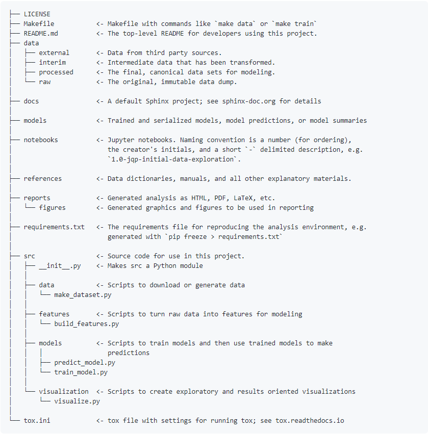

# Project Structure

So far we have used the word *"project"* to refer to a Git/Github *"repository"*. In this section we also use this definition. But of course, all the recommendations presented here are for generic projects (i.e. not only code projects version controlled with Git).

## General Structure

In order for your project to be easily understood by your **future self and others**, the project must have a **proper directory structure**.  

As a rule-of-thumb a proper directory structure should have as a minimum the following content:  

- **README** file  
- **LICENSE** file  
- **notebook**  
- **data** folder (with a static copy of the **raw (original) data**)  
- **code** folder (often named `src`)   
____________________________________________________________


Image by [Peggy und Marco Lachmann-Anke](https://pixabay.com/users/peggy_marco-1553824/?utm_source=link-attribution&amp;utm_medium=referral&amp;utm_campaign=image&amp;utm_content=1015594) from [Pixabay](https://pixabay.com/?utm_source=link-attribution&amp;utm_medium=referral&amp;utm_campaign=image&amp;utm_content=1015594)

## README

In every project there should be at least a **top-level README** file in a simple text format (e.g., `.txt` or `.md`). This means, a `README` file at the top of the directory structure of the project. 

Generally speaking, the `README` file is where you must **document**:   

- what the code does;   
- how the code/repository is structured;    
- what is needed for the code to run (dependencies and versions of libraries with which the code has been developed);   
- instructions on how to compile and run the code;   
- references and acknowledgements (this could also be in a separate directory within the repository).  

The `README` in a repository should be **understandable** not only by you (and your future self!), but also by others (especially if the repository becomes public or if it will be re-used/further-developed within your work group).   

**Recommendation:** do not write the `README` at the very last minute. But **keep it alive** during the development of the project. And by the end of the project ask a colleague for **feedback** on it.  

_________________________________

### Do you need a README template?

You can find `README` templates for data, code and machine-learning projects [here](https://github.com/HeatherAn/recommended-coding-practices/tree/main/templates). Notice that:  
   - The `README` for a data repository (`README_data.txt`) is in `.txt` format. Fill it in according to what is asked in commented text (in between `<!---` and `-->`). Then rename the file as `README.txt` and put it at the top-level of the `data/` directory.      
   - The `README` for a code repository (`README_code.md`) and machine-learning projects (`README_ML.md`) are written in [**Markdown**](https://www.markdownguide.org/) language. This language uses a rather simple syntax that can be read by any text editor, and becomes prettier when interpreted by browsers. Use the `Code` tab instead of the `Preview` tab to see the commented text. Fill in the template according to what is asked in commented text (in between `<!---` and `-->`). Then rename the file as `README.md` and keep it at the top-level of the project directory tree-structure.    

_________________________________

### Parenthesis

By now you have probably noticed that Github has the option to initialize the repository with a `README`. We have recommended not to tick that option for educational purposes only (e.g., to explain how to `push` a *local* repository to the *remote*). However, of course having a **README** file is *essential* when having a Git/Github repository. If you tick the option, you will notice that a `README.md` file is created, which you can easily visualize in Github. The `md` extension refers to [**Markdown**](https://www.markdownguide.org/) language. Interested in more about **Markdown**? Check the syntax [here](https://www.markdownguide.org/basic-syntax/). 

Do you want to practice a bit more on it? Check out this [StackEdit app](https://stackedit.io/app#).

__________________________________


Image by [Peggy und Marco Lachmann-Anke](https://pixabay.com/users/peggy_marco-1553824/?utm_source=link-attribution&amp;utm_medium=referral&amp;utm_campaign=image&amp;utm_content=5523784) from [Pixabay](https://pixabay.com/?utm_source=link-attribution&amp;utm_medium=referral&amp;utm_campaign=image&amp;utm_content=5523784)

## LICENSE

When creating the repository it is always advisable to have either a `LICENSE` file (in `.txt` or `.md` format), or a directory called `LICENSE` where the future license(s) file(s) will be. A license **sets the terms** in which the code (or data) can be **re-used by others**. There are highly restrictive licenses (for commercialization of code for example) and there are less restrictive ones, such as the **open-source licenses**. The open-source licenses essentially say "use this at your own risk, but give me proper attribution when using it". We will cover a bit of licenses in the [Publish Or Archive](https://github.com/HeatherAn/recommended-coding-practices/blob/main/22-Publish-Or-Archive.md) section.

**Recommendation:** even if you do not know whether the project is going to be **published** (for everyone to reuse) or **archived** (for only a specific group to re-use), it is always good to create the `LICENSE` either as an empty file or as an empty directory. Having it in your repository during the development of the project will serve as a **reminder** that you have to choose a license when finishing the project. So that others know how to re-use your work.  

____________________________________________


Image by [Peggy und Marco Lachmann-Anke](https://pixabay.com/users/peggy_marco-1553824/?utm_source=link-attribution&amp;utm_medium=referral&amp;utm_campaign=image&amp;utm_content=1992593) from [Pixabay](https://pixabay.com/?utm_source=link-attribution&amp;utm_medium=referral&amp;utm_campaign=image&amp;utm_content=1992593)

## Notebook

A notebook is where you can document examples on **how to use** the code presented in the repository. Tools like [**Jupyter notebooks**](https://jupyter.org/) and [**Quarto**](https://quarto.org/) allow you to create notebooks where you can add **formulae/text/images/weblinks** (in markdown language but also Latex!), and you can write/run **code** (written in Python, R, [C++](https://blog.jupyter.org/interactive-workflows-for-c-with-jupyter-fe9b54227d92), even [MATLAB](https://am111.readthedocs.io/en/latest/jmatlab_use.html)). MATLAB also allows you to have notebooks in its **Live Editor**. All of these are excellent tools for reproducibility! Great for your future self and for the reusers!

Interested in Jupyter notebooks? See examples [here](https://github.com/Hvass-Labs/TensorFlow-Tutorials). There the [developer](https://github.com/Hvass-Labs) has created several Jupyter notebooks (`.ipynb`) with tutorials on Data Science algorithms using [Tensorflow](https://www.tensorflow.org/). Even though they are *tutorials* on methodology, you can see how the notebooks look like! Also notice that all these tutorials have been shared with the community under an [open-source license](https://github.com/Hvass-Labs/TensorFlow-Tutorials/blob/master/LICENSE).  

There are many more [examples](https://github.com/jupyter/jupyter/wiki/A-gallery-of-interesting-Jupyter-Notebooks) on all types of topics. Have fun with it!

**Recommendation:** you can write the notebook in whichever way you prefer (e.g., as a Bash script or as a Jupyter notebook) as long as it is provided in a **format** that others can easily open and run/follow (e.g., without having to pay for a specific software). In addition to that, when writing a notebook, explain how the code can be used with an **exemplifying (input) dataset**. This dataset does not have to be a gigantic dataset with which the code will take days to run. It has to be a **small** dataset that others can easily access and download (e.g., from a data archive such as the [4TU.ResearchData](https://data.4tu.nl/info/en/) or [Zenodo](https://zenodo.org/)). So that by running the notebook (or following its instructions) re-users know that the code is properly installed.   

____________________________________________


Image by [Peggy und Marco Lachmann-Anke](https://pixabay.com/users/peggy_marco-1553824/?utm_source=link-attribution&amp;utm_medium=referral&amp;utm_campaign=image&amp;utm_content=1889004) from [Pixabay](https://pixabay.com/?utm_source=link-attribution&amp;utm_medium=referral&amp;utm_campaign=image&amp;utm_content=1889004)

## Data

In every project there is data. In coding projects, data is used to e.g., build/test and run the code. Hence, there should always be a `data` folder with sub-folders containing -in general- the:  

- **raw original** data;   
- **input** data to the code (e.g., processed/data-engineered data);   
- **auxiliary** data (e.g., data files containing fixed settings/parameters so that the code can function);   
- **output** data of the code.   

___________________________________


Image by [Peggy und Marco Lachmann-Anke](https://pixabay.com/users/peggy_marco-1553824/?utm_source=link-attribution&amp;utm_medium=referral&amp;utm_campaign=image&amp;utm_content=1015304) from [Pixabay](https://pixabay.com/?utm_source=link-attribution&amp;utm_medium=referral&amp;utm_campaign=image&amp;utm_content=1015304)

### Static Copy of Raw Original Data

As mentioned before, within the `data` folder, there should be a sub-folder containing the **raw data**, which should remain **intact** even if it is given as input to the code *as it is* (i.e., without any processing). If the data was obtained from an online database/archive, then you should keep the reference to it in the **README** file and in the **notebook**. You can also provide instructions on how to download it. For example, by providing a **Bash script** where you use the `wget` command showing re-users how to retrieve files via the command line using HTTP, HTTPS, and FTP protocols (see more about `wget` [here](https://www.gnu.org/software/wget/)) and in the [Bash Cheatsheet](https://github.com/HeatherAn/recommended-coding-practices/blob/main/05-Bash-Cheatsheet.md).  

### Important to keep in mind: use `git ignore` for data!

A Github repository is **not a data repository**. Keep the data in your *local* repository (in your laptop/workstation). Work *locally*, and when *pushing* the changes to the online *remote* Github repository, use a `.gitignore` file to **ignore the data files**. See more on `.gitignore` in the  [Using Git For The First Time](https://github.com/HeatherAn/recommended-coding-practices/blob/main/08-Using-Git-For-The-First-Time.md) section.  

_________________________________

## Using Project Templates

A recommended tool for creating a proper project (directory tree) structure is to use **project templates**. One of these tools is [Cookiecutter](https://cookiecutter.readthedocs.io/en/latest/README.html). Even though you need Python to install **Cookiecutter**, you do not have to know Python to use **Cookiecutter**. Once you run a **Cookiecutter** template, the project structure is created in your working directory. You can then proceed to code in whichever language you want/have-to. Also, even if you are not familiar with Python, you can take a look at the templates and use them as inspiration for creating your own directory structure (e.g. with Bash commands).  

To use **Cookiecutter** you first have to install it. Go to the terminal and type the following:  

```
pip install -U cookiecutter
```   
Where the `-U` flag tells the system to upgrade all packages to the newest available version (in case there are packages that have already been installed before in your system).  

After installing **Cookiecutter** you can tell it to run a given *project template*. For example, a project template for **Data Science** projects can be found [here](https://github.com/drivendata/cookiecutter-data-science). To run that project template, in the terminal go to the directory where you want to create the project. For the following, we will assume you are a Windows user and want to call the working directory `Project_A` in the directory `/c/Users/your_user_name/Documents/`. Then in the terminal:  

```
cd /c/Users/your_user_name/Documents/  
cookiecutter https://github.com/drivendata/cookiecutter-data-science
```    
**Cookiecutter** will then ask you (everything within the terminal itself):   
   - `project_name` : name of the project. In the example we have considered, the project_name would be `Project A`. In this case, the `project_name` will be included in the -for example- **README** file that the project template creates by default.    
   - `repo_name` : name of the repository that will be created. For this name, **avoid white spaces**. Use `_` instead. In the example we have considered, the `repo_name` would be `Project_A`.  
   - `author_name` : your name. Your name will be included as the author in the metadata of the project.  
   - `description` : short description of what the project is about. It will also show up in the documentation files that the project template creates.  
   - `Select open_source_license` : it will show you some options for open-source licenses (the [MIT](https://choosealicense.com/licenses/mit/) and the [BSD-3-Clause](https://choosealicense.com/licenses/bsd-3-clause/)). There is also the option of **No license** file. If you do not know yet under which license the code will be shared with others, you can select the **No license** file option (option #3). But then **create an empty LICENSE file** (with `touch LICENSE`) in the directory of the project. And add the respective license file once you have decided on one.  
   - `s3_bucket` : this is a bucket in [Amazon cloud storage](https://aws.amazon.com/s3/). The template asks you for this in case you have a bucket in Amazon where the data is stored. If you do not have such a cloud storage service, then leave it empty, and modify the documentation and `Makefile` at a later stage.  
   - `aws_profile` :  this also asks you for an Amazon Web Service profile. If you do not have one, then just leave it blank and modify the documentation and `Makefile` at a later stage.  
   - `Select python_interpreter` : Python version you will be using to code (e.g., `python3`). If you will not be working with Python, do not worry! You can let **Cookiecutter** create the project structure based on this template, and then modify the documentation and `Makefile` accordingly. 

Once you answer all those questions, **Cookiecutter** will create (in the current directory) the following structure in the `Project_A` directory:



Now explore it! If you do `ls -a` to see hidden files/directories, you will see that a `.gitignore` file has already been created. Check it out!

Notice there is a **top-level README** file, a **LICENSE** file, a `data/` directory and a `notebook/` directory. Notice that in `.gitignore` file it is established that when using Git, Git should ignore the `data` folder and everything in it.

Check more about the Data Science cookiecutter template [here](https://github.com/drivendata/cookiecutter-data-science). Not the template for your project? [There are more!](http://cookiecutter-templates.sebastianruml.name/) They are spread everywhere, but Google or ChatGPT is always your friend to find them! Even if you do not find one that applies exactly to your project, you can start from a template that is close to the one you need, and you can then modify it accordingly (using Bash).

## Pushing your Structured Project to Github

Now that you have created a proper project structure *locally*, *push* it to a Github repository. Don't remember how to *push*? Check the [Using Git For The First Time](https://github.com/HeatherAn/recommended-coding-practices/blob/main/08-Using-Git-For-The-First-Time.md) section and/or the [Git Cheatsheet](https://github.com/HeatherAn/recommended-coding-practices/blob/main/13-Git-Cheatsheet.md)    

You can now start working within the project structure, **pulling**, **adding**, **committing** and **pushing** changes, syncing the *local* repository with the respective *remote* Github repository.

________________________

[Previous : 13 - Git Cheatsheet](https://github.com/HeatherAn/recommended-coding-practices/blob/main/13-Git-Cheatsheet.md)  
[Next : 15 - Coding Conventions](https://github.com/HeatherAn/recommended-coding-practices/blob/main/15-Coding-Conventions.md)  

[Go back to README](https://github.com/HeatherAn/recommended-coding-practices#readme)