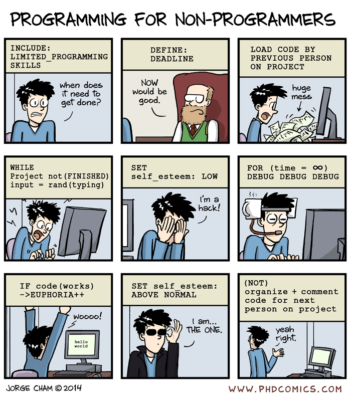

# Coding Conventions

In this section we will cover **general principles and guidelines** to follow when writing and designing code.

## What are code conventions? 

Code conventions are essentially guidelines on how to write and design code in a specific programming language. They can cover different topics ranging from code structure to embedded documentation rules, naming conventions, testing practices, etc. Depending on the language, some conventions can be more generic while others can be quite specific.

## Why the need for code writing conventions?

Code conventions are meant to standardize the way code is developed in order to make it more *interoperable* and facilitate its *reuse* and *maintenance* by making it easily *readable* by others. 

[“Piled Higher and Deeper”](http://phdcomics.com/comics/archive.php?comicid=1690) by Jorge Cham, http://www.phdcomics.com

## General Principles

As mentioned before, there are different conventions for different programming languages. Different conventions cover different topics, and while some conventions are widely spread, others are less used. Thus there is *no single ring to rule them all!* But overall, there are certain principles that everyone can follow when writing code, regardless of the programming language they are using. 

______________________________________________________
### Important to keep in mind: Python PEPs

One of the languages for which more conventions have been agreed by the community is Python. These conventions are proposed and established by the so-called [Python Enhancement Proposals](https://www.python.org/dev/peps/) (PEPs). There are different types of PEPs, some of them are for describing new features or implementations of Python, and others are meant to provide guidelines for Python users and developers. Among all the PEPs there are we encourage you to take a look at [PEP 8](https://www.python.org/dev/peps/pep-0008/) which is the style guide for Python code, and [PEP 7](https://www.python.org/dev/peps/pep-0007/) which is a coding convention for the C code comprising the C implementation of Python. 

______________________________________________________

### The Zen of Python

This is a collection of 19 guiding "principles" originally written by Tim Peters, one of the main contributors to Python. Even though these principles are written thinking of Python, these "principles" can be overall applied to all programming languages. 

*The Zen of Python, by Tim Peters*   

*Beautiful is better than ugly.*  
*Explicit is better than implicit.*  
*Simple is better than complex.*  
*Complex is better than complicated.*  
*Flat is better than nested.*  
*Sparse is better than dense.*  
*Readability counts.*  
*Special cases aren't special enough to break the rules.*  
*Although practicality beats purity.*   
*Errors should never pass silently.*  
*Unless explicitly silenced.*  
*In the face of ambiguity, refuse the temptation to guess.*  
*There should be one-- and preferably only one --obvious way to do it.*  
*Although that way may not be obvious at first unless you're Dutch.*  
*Now is better than never.*  
*Although never is often better than *right* now.*  
*If the implementation is hard to explain, it's a bad idea.*  
*If the implementation is easy to explain, it may be a good idea.*  
*Namespaces are one honking great idea -- let's do more of those!*

Summarizing this into more specific guidelines:

1. Keep the code **simple**.
2. Prioritize the **readability** of the code.    
3. Take some time to properly **name** different objects.  
4. Code assuming there will be **errors**.  
5. Take care of the **embedded documentation**.  

And most importantly: **stick to them!**

In the following sections we will see these one by one. 

________________________

[Previous : 09 - Project Structure](https://github.com/HeatherAn/recommended-coding-practices/blob/main/09-Project-Structure.md)  
[Next : 11 - Keep It Simple](https://github.com/HeatherAn/recommended-coding-practices/blob/main/11-Keep-It-Simple.md)  

[Go back to README](https://github.com/HeatherAn/recommended-coding-practices#readme)
