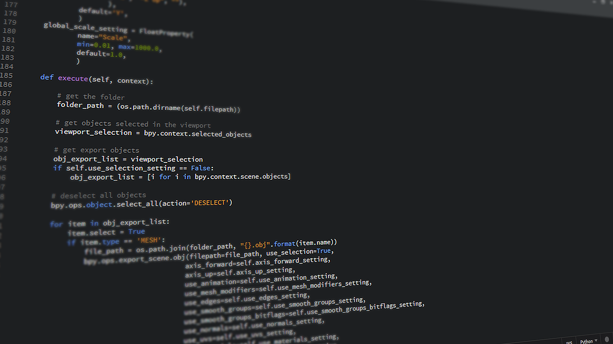

# Recommended Coding Practices

We are not professional coders, but we all must code to **survive!** 

Image by [Johnson Martin](https://pixabay.com/users/johnsonmartin-724525/?utm_source=link-attribution&amp;utm_medium=referral&amp;utm_campaign=image&amp;utm_content=1084923") from [Pixabay](https://pixabay.com/?utm_source=link-attribution&amp;utm_medium=referral&amp;utm_campaign=image&amp;utm_content=1084923)

In this **Recommended Coding Practices** repository you will find introductory and broad material to start developing **proper code** and promote further **self-study**. 

_______________________

The material was originally designed for researchers within the Department of [Aerospace Structures and Materials](https://www.tudelft.nl/lr/organisatie/afdelingen/aerospace-structures-and-materials) of the [Faculty of Aerospace Engineering (AE)](https://www.tudelft.nl/en/ae) of the Delft University of Technology (TU Delft) in The Netherlands. 
________________________

Practice and enjoy!

## Contents

- [Unix Shell commands](https://github.com/HeatherAn/recommended-coding-practices/blob/main/01-Unix-Shell-Commands.md)
- [Version control with Git](https://github.com/HeatherAn/recommended-coding-practices/blob/main/03-Version-Control-with-Git.md)
- [Project structure](https://github.com/HeatherAn/recommended-coding-practices/blob/main/09-Project-Structure.md)
- [Coding conventions](https://github.com/HeatherAn/recommended-coding-practices/blob/main/10-Coding-Conventions.md)  
- [Environment variables](Environment-Variables) 
- [Make command](Make-Command)
- Guidelines on what to do once you [**finish a project**](What-to-do-once-I-finish)  
- Guideline on [**how to contribute to the Wiki**](How-to-Change-the-Wiki)  
- [README templates](https://github.com/HeatherAn/recommended-coding-practices/tree/main/templates) for data, code and machine-learning projects.  
    * The README for data (`README_data.txt`) is in txt format. Fill it in according to what is asked in commented text (in between `<!---` and `-->`). Then rename the file to README.txt.   
    * The README for code (`README_code.md`) and machine-learning projects (`README_ML.md`) are written in Markdown. Use the `Code` tab instead of the `Preview` tab to see the commented text. Fill in the template according to what is asked in commented text (in between `<!---` and `-->`). Then rename the file to README.md.    

## How to follow the material?

The material is presented in separate **Markdown** files. In order to go through the material, please **follow the numerical order** of the names of the files. At the end of each page you will also find the **Previous** and **Next** links that will take you through the material in sequential order.

## References

The material has been built upon from the content provided by open sources such as the [Software Carpentry](https://software-carpentry.org/) and [Code Refinery](https://coderefinery.org/) initiatives.

_________________________

[Next     : 01 - Unix Shell commands](https://github.com/HeatherAn/recommended-coding-practices/blob/main/01-Unix-Shell-Commands.md)